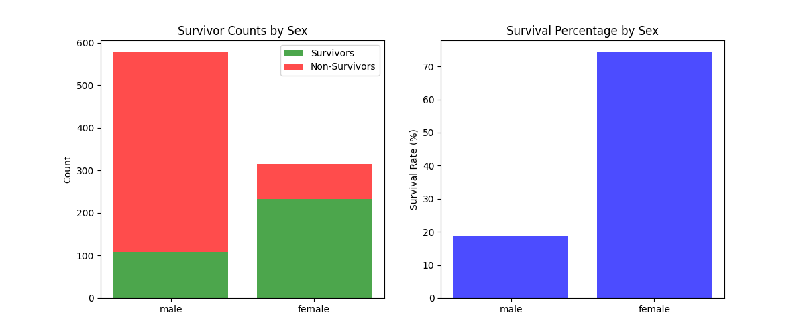

# Titanic Dataset Exploratory Data Analysis

A Python-based statistical analysis project exploring survival patterns on the Titanic. This tool processes raw passenger data to identify correlations between demographics (age, class, gender) and survival rates using custom visualization scripts.

## Key Findings & Visualizations
Analysis reveals a significant disparity in survival rates across different demographics. 


*Figure 1: Survival rates broken down by gender, highlighting the higher survival probability for female passengers.*

## Project Overview
* **Objective:** Identify and visualize trends in survival probability based on passenger attributes.
* **Dataset:** `titanic_clean.csv` (Features: Age, Class, Fare, Family Size, Survival Status).
* **Methodology:**
    * **Data Ingestion:** Custom parsing of CSV data into structured Python dictionaries.
    * **Statistical Analysis:** Computation of mean, standard deviation, mode, and Pearson correlation coefficients.
    * **Visualization:** Generation of scatterplots and bar charts to map variable relationships.

## Files Structure
* `titanic.py` – Core analysis engine. Handles data loading, statistical summaries, and correlation algorithms.
* `survivors.py` – Extended visualization module. Generates categorical bar charts (e.g., survival by gender/class).
* `analysis_script.py` – Execution script for running specific analysis routines.
* `titanic_clean.csv` – Processed dataset used for analysis.

## Installation & Usage

1.  **Clone the repository**
    ```bash
    git clone [https://github.com/05ashton/Titanic-Dataset-Analysis.git](https://github.com/05ashton/Titanic-Dataset-Analysis.git)
    cd Titanic-Dataset-Analysis
    ```

2.  **Install dependencies**
    ```bash
    pip install -r requirements.txt
    ```

3.  **Run the analysis**
    ```bash
    python titanic.py
    ```

## Skills Demonstrated
* **Data Analysis:** Statistical profiling (min/max, mean, stdev) and correlation analysis (Pearson coefficient).
* **Python Development:** Efficient dictionary manipulation and modular code structure.
* **Data Visualization:** Programmatic generation of insights using Matplotlib.

---
**Author**
Ashton Curl
[LinkedIn](https://www.linkedin.com/in/ashton-curl-a7b804371/) | [GitHub](https://github.com/05ashton)
